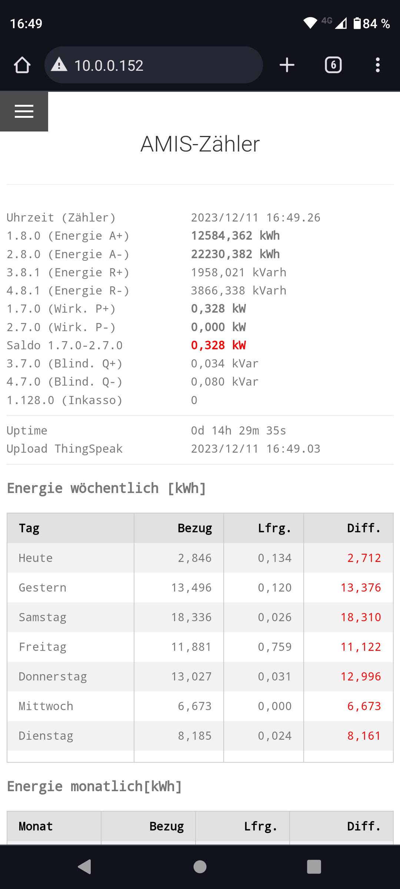
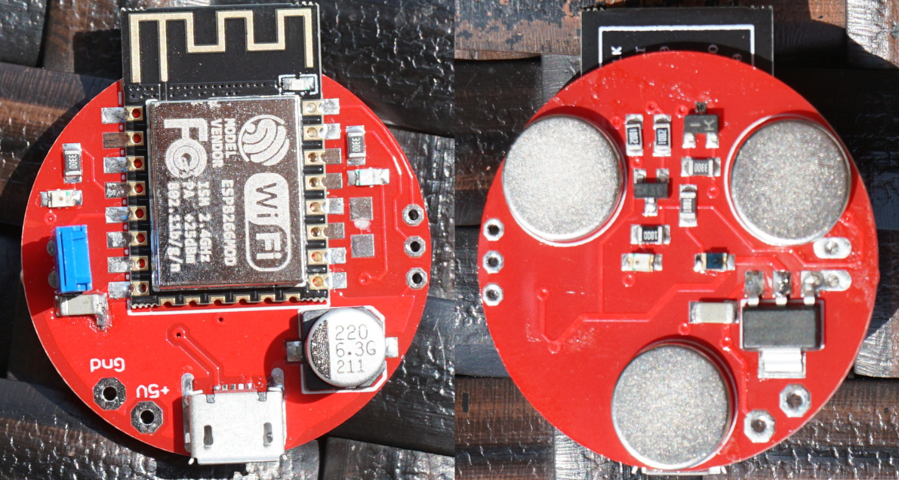
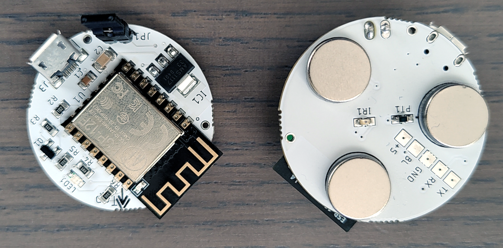

# AMIS Lesegerät für die NetzOÖ Smartmeter Kundenschnittstelle

Der AMIS Leser ist ein kostengünstiger, autonomer, Cloud-free Lesekopf auf ESP8266 Basis, um den NetzOÖ Smartmeter Siemens TD-3511/TD-3512 per Wifi auszulesen. (Zählwerke, aktueller Verbrauch/Einspeisung)
Dies ist für Hausautomatisierungen oder PV geregelte Verbrauchssteuerungen (Eigenverbrauchsoptimierung; E-Auto laden; Nulleinspeisung) sehr hilfreich, oder auch nur, um den aktuellen Leistungsbezug in Echtzeit abzufragen.

Es steht ein Webinterface mit allen wichtigen Werten und zur Parametereinstellung zur Verfügung, per REST API können die aktuellen Zähler- und Verbrauchsdaten im JSON-Format abgerufen werden, per MQTT an einen Broker weitergegeben, per Modbus/TCP abgerufen werden oder an ThingSpeak hochgeladen werden. Die grafische Ansicht der historischen ThingSpeak Daten ist über einen Menüpunkt im Webinterface möglich.
Der NetzOÖ Smartmeter gibt Daten im Sekundentakt aus, somit stehen jede Sekunde neue Daten (Zählerstände Verbrauch und Einspeisung, aktueller Bezug/Einspeisung, Saldo aus Bezug-Einspeisung) zur Verfügung.

Der Amis Reader benötigt eine 5V Spannungsversorgung (max. 0,13A, typ. 0,075A; Leistungsaufnahme < 1W) durch ein Micro-USB Netzteil und wird magnetisch durch 3 Magnete, die an der Platinenunterseite  angeklebt sind, an der optischen Kundenschnittstelle des Siemens Smartmeter gehalten.

Der AMIS Reader emuliert auch einen Fronius Smartmeter (nur Einspeisepunkt Adresse 1) per Modbus/TCP für einen Fronius Symo (ab Datamanager Version 3.28.1-3) oder Gen24 Wechselrichter. Siehe dazu Docs/AmisFroniusSmartmeter.pdf.
In der aktuellen Version ist es auch möglich eine (Tasmota-)Wifi Steckdose aufgrund von PV Überschuss anzusteuern. ("Ein" unter Saldowert; "Aus" über Saldowert; Url für Ein bzw Aus)

Startseite Webinterface:

## Inbetriebnahme
Der Amis-ESP8266 läuft normalerweise im Station-Mode, d.h. der ESP8266 verbindet sich als Client mit einem Wlan Router/AP. Dazu muss er aber erst einmal die SSID und das Wlan Passwort kennen. Daher wird der ESP8266 zur Einrichtung in den AP-Mode (Access-Point) versetzt. Das geschieht, indem man mit gesetztem Jumper (Steckbrücke) bootet. 
Mit einem Handy, Tablett oder Notebook kann man das WiFi-Netz "ESP8266_AMIS" verbinden. Nach dem Verbinden einen Web-Browser starten und als Adresse http://192.168.4.1 eingeben. Menü / Wifi wählen und Netzwerkeinstellungen vornehmen, wir empfehlen dem AMIS Reader eine fixe IP zu geben, damit ist er immer mit der gleichen IP in deinem Netzwerk erreichbar. Gateway- und Namenserver-IP Adresse sind u.a. für Thingspeak notwendig.
Ev. auch gleich den AMIS/MBUS-Schlüssel vom NetzOÖ Portal (siehe dazu docs\AmisMBUSKey.pdf) eingeben, auf Allgemein "ThingSpeak/Highcharts aktiv" vorläufig nicht aktivieren. Jumper/Steckbrücke nun öffnen/abziehen und rebooten, nun sollte der Amis Leser über die gewählte IP erreichbar sein. Erzeugt er wieder das Wlan Netz "ESP8266_AMIS", obige Schritte wiederholen, vielleicht wurden Daten falsch eingegeben.
Der Amis Leser muss mit dem USB Port nach oben bzw schräg rechts unten (je nach Version) an den richtigen (AMIS/MBUS Key) Siemens TD3511 magnetisch angeheftet werden. 
RFPower ermöglicht die Kontrolle über die Sendeleistung, wobei weniger Sendeleistung anzuraten ist. 0dBm ist 1mW, was für kleinere Entfernungen genügt. Maximal 20dBm.
Sind die Einstellungen (vor allem der MBUS Key aus dem NetzOÖ Portal) korrekt, dann sollten unter Zähler Werte angezeigt werden. Wenn die Entschlüsselung der Daten unplausible Daten erzeugt, wird dies durch eine Meldung "falscher MBUS Key" angezeigt. Es dauert 1-2 Minuten bis Zähler und ESP synchron sind. Die Leds für TxD und RxD blinken dann im Sekundentakt.

## AMIS Hardware. PCB von Jlcpcb, händisch bestückt und gelötet:

## AMIS Hardware V2. Maschinell bestückt und gelötet:

## 31mm Drahtantenne verbessert Wifi Konnektivität um ca 8dB:
Man kann ganz einfach die Wifi Konnektivität verbessern, in dem man die PCB Antenne auftrennt und einen Draht wie am Bild anlötet.

## Danksagung
Vielen Dank an Gottfried Prandstetter für die grandiose Entwicklungsarbeit an diesem Projekt. Er stellt die Soft- und Hardware als open-source zur Verfügung.
